# 220315 플랫폼 비즈니스

## 2주차
- 안드로인드 스튜디오 설치, 깃허브 저장소 생성

</img>

## 3주차
- 버튼을 사용해 네이버 앱, 전화화면에 접속하고 메세지 띄우기 만들기 

</img>
</img>
</img>

## 5주차
- 버튼을 눌러 이미지 바꾸기

</img>
</img>
</img>
</img>

## 6주차
- 스크롤뷰 이용
- 자바로 버튼클릭으로 이미지 바꾸는 것 작업
- Interger.toString()함수 사용해 Toast 메세지 띄우기

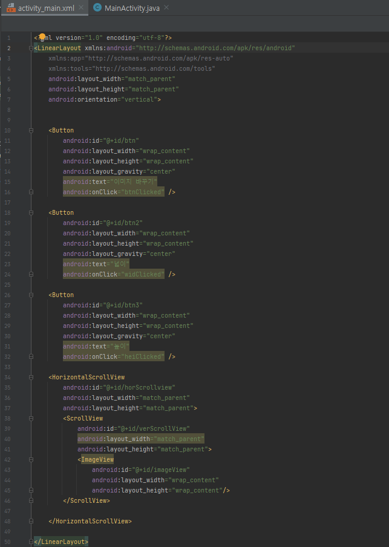</img>
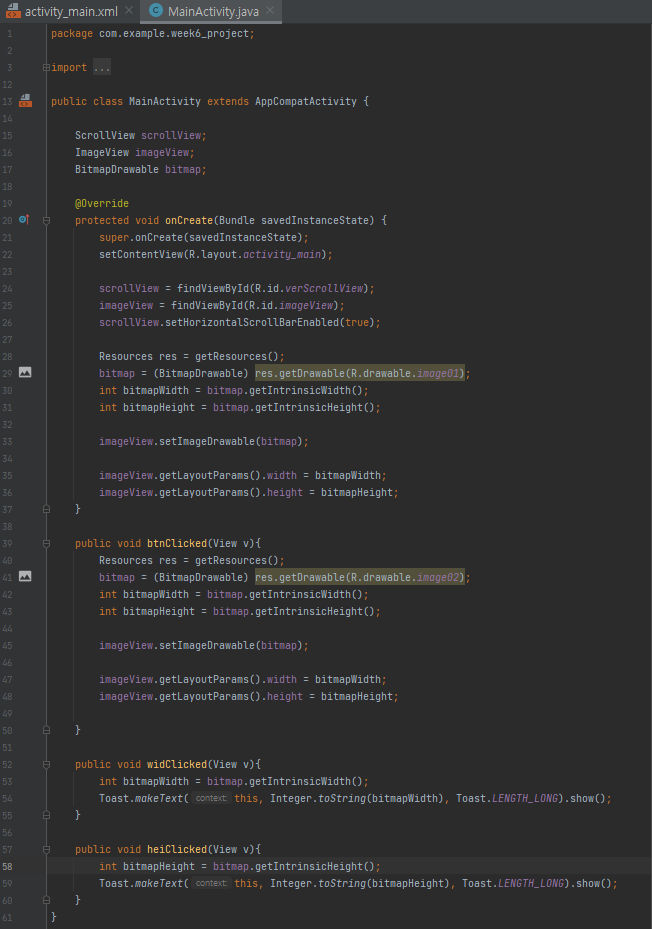</img>
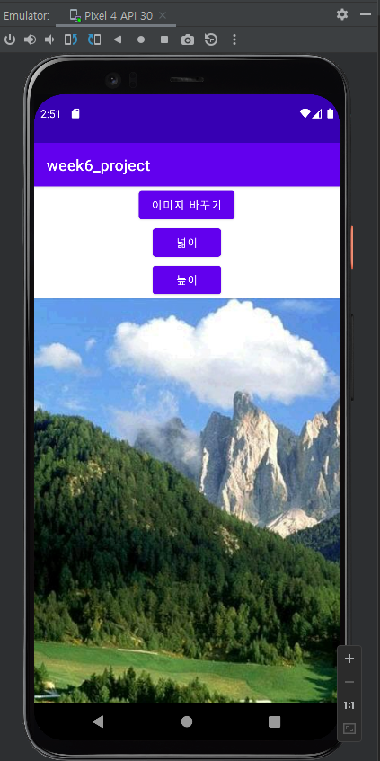</img>
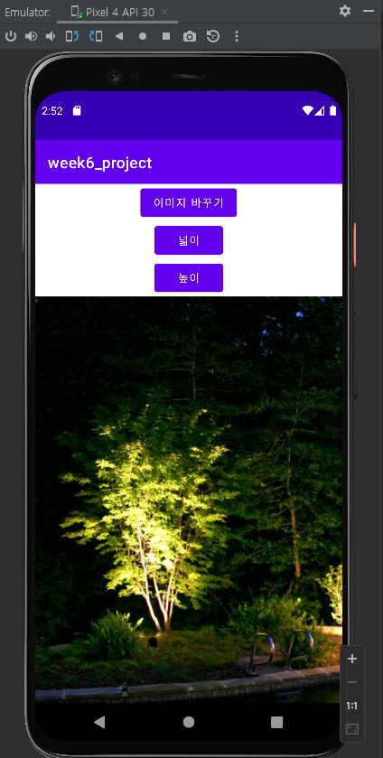</img>
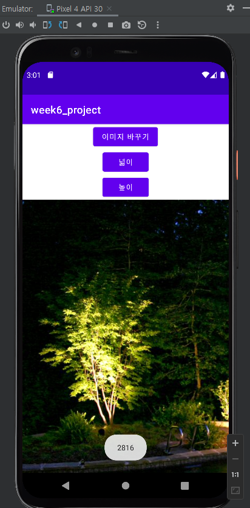</img>
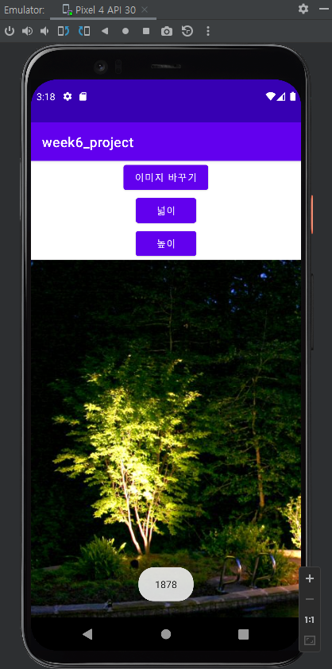</img>

## 10주차
- 메뉴의 요청을 받아 메인에서 값을 출력
- 버튼을 누르면 메뉴화면이 뜨고, 돌아가기 버튼을 누르면 토스트 메세지 창이 뜸

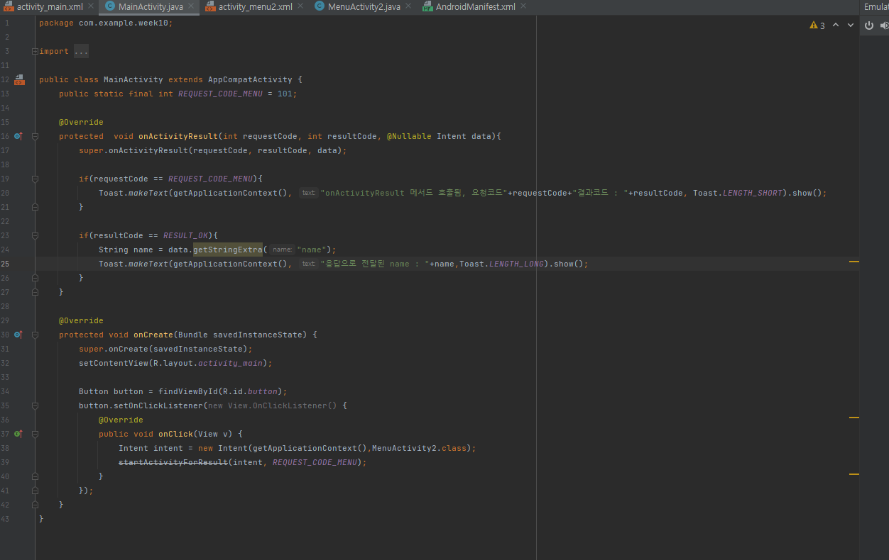</img>
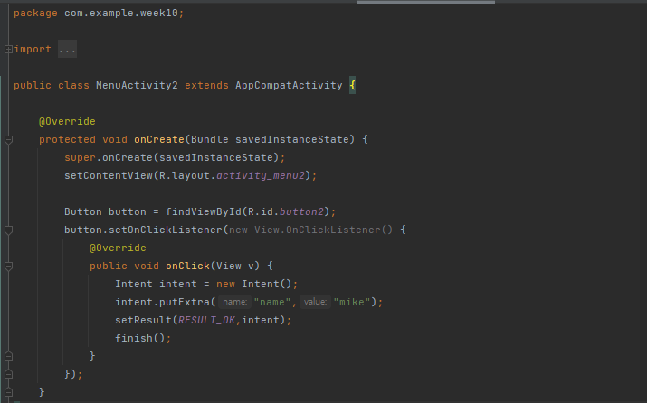</img>
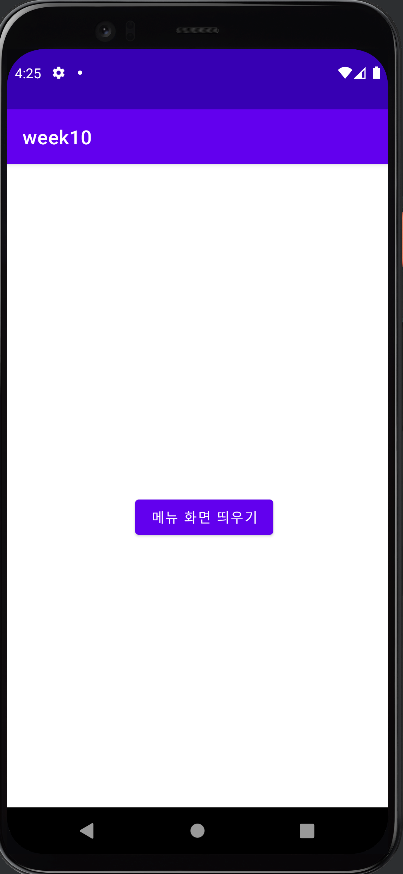</img>
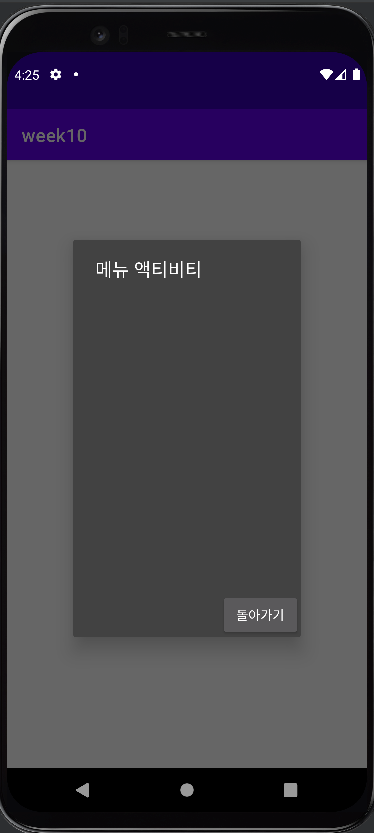</img>
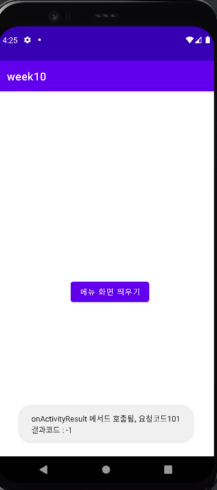</img>
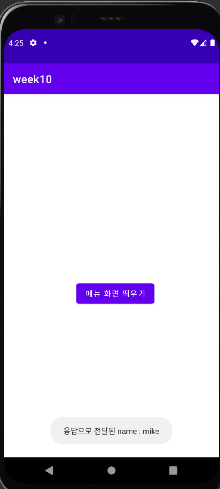</img>

## 10주차
- wep의 api Key값을 받아 요청을 수행한다

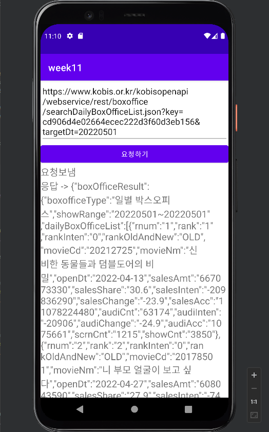</img>
